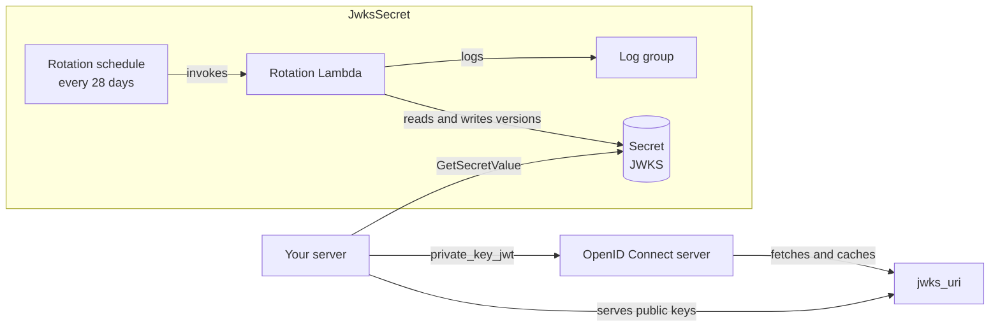

# cdk-jwks-secret

[](https://github.com/justin-tay/cdk-jwks-secret/actions/workflows/ci.yml)
[](https://www.npmjs.com/package/cdk-jwks-secret)
[](LICENSE)

An AWS CDK construct for a JWK Set stored in a Secrets Manager secret and
rotated by a Lambda. The secret starts empty and is initialised with 2 keys by
the rotation triggered when the stack is deployed. Every 28 days a new key is
added, keeping at most 3, so that a key is published before it is used, e.g.
for `private_key_jwt` client authentication with an OpenID Connect server.

| **Reference documentation** |                                                                                                                         |
| --------------------------- | ----------------------------------------------------------------------------------------------------------------------- |
| Secrets Manager rotation    | [Rotate AWS Secrets Manager secrets](https://docs.aws.amazon.com/secretsmanager/latest/userguide/rotating-secrets.html) |
| `private_key_jwt`           | [OpenID Connect Core 1.0, section 9](https://openid.net/specs/openid-connect-core-1_0.html#ClientAuthentication)        |
| JSON Web Key (JWK)          | [RFC 7517](https://www.rfc-editor.org/rfc/rfc7517)                                                                      |
| JSON Web Algorithms (JWA)   | [RFC 7518](https://www.rfc-editor.org/rfc/rfc7518)                                                                      |
| JWK thumbprint (`kid`)      | [RFC 7638](https://www.rfc-editor.org/rfc/rfc7638)                                                                      |
| Guides                      | [How rotation works](docs/how-rotation-works.md), [Using the keys](docs/using-the-keys.md), [Logging](docs/logging.md)  |

## Overview

Install the package; `aws-cdk-lib` and `constructs` are peer dependencies:

```sh
npm install cdk-jwks-secret
```

Then add a `JwksSecret` to a stack:

```ts
import { JwksSecret } from 'cdk-jwks-secret';

const jwksSecret = new JwksSecret(this, 'ClientJwks', {
  use: 'sig', // default; ES256 keys. Use 'enc' for ECDH-ES+A128KW keys.
});

jwksSecret.grantRead(serverTaskRole);
```

Your server reads the secret, serves its public keys from the client's
`jwks_uri` and signs (or decrypts) with the private keys; see
[Using the keys](docs/using-the-keys.md).

> **Cost:** the secret is retained by default when the stack is destroyed and
> costs $0.40 per month until it is deleted. See [Removal and cost](#removal-and-cost).

## Construct Props

| **Name**               | **Type**                                                                                                                                                                                | **Default**                                                                                           | **Description**                                                                                                                                                                                                                                                                                                                              |
| ---------------------- | --------------------------------------------------------------------------------------------------------------------------------------------------------------------------------------- | ----------------------------------------------------------------------------------------------------- | -------------------------------------------------------------------------------------------------------------------------------------------------------------------------------------------------------------------------------------------------------------------------------------------------------------------------------------------- |
| use?                   | `JwkPublicKeyUse`                                                                                                                                                                       | The use of `algorithm`, or `'sig'`                                                                    | Whether the keys sign (`'sig'`, e.g. for `private_key_jwt`) or encrypt (`'enc'`, e.g. for encrypted ID tokens). Selects the default algorithm. If `algorithm` is also given, it must have this use.                                                                                                                                          |
| algorithm?             | `JwkAlgorithm`                                                                                                                                                                          | `'ES256'` for `sig`, `'ECDH-ES+A128KW'` for `enc`                                                     | The JWA algorithm of every key. For `sig` keys: `RS256` `RS384` `RS512` `PS256` `PS384` `PS512` `ES256` `ES384` `ES512`. For `enc` keys: `RSA-OAEP-256` `ECDH-ES` `ECDH-ES+A128KW` `ECDH-ES+A192KW` `ECDH-ES+A256KW`. Determines the key type, the use and, for `ES*`, the curve.                                                            |
| curve?                 | `JwkEcCurve`                                                                                                                                                                            | Implied by `algorithm`; `P-256` for `ECDH-ES*`                                                        | The EC curve: `P-256`, `P-384` or `P-521`. Can only be chosen for `ECDH-ES` and `ECDH-ES+A*KW`. For `ES*` it must match the algorithm.                                                                                                                                                                                                       |
| rsaModulusLength?      | `number`                                                                                                                                                                                | `2048`                                                                                                | The RSA modulus length in bits, a multiple of 8 from 2048 to 4096. For RSA algorithms only.                                                                                                                                                                                                                                                  |
| secretProps?           | [`Pick<SecretProps, 'secretName' \| 'description' \| 'encryptionKey' \| 'removalPolicy'>`](https://docs.aws.amazon.com/cdk/api/v2/docs/aws-cdk-lib.aws_secretsmanager.SecretProps.html) | A generated name, no description, the AWS managed key `aws/secretsmanager` and `RemovalPolicy.RETAIN` | Overrides for the secret. Its value is always managed by the construct. It is retained by default because deleting it loses the keys the client registration relies on; see [Removal and cost](#removal-and-cost).                                                                                                                           |
| rotationLambdaProps?   | [`Pick<FunctionProps, 'memorySize' \| 'vpc' \| 'vpcSubnets' \| 'securityGroups'>`](https://docs.aws.amazon.com/cdk/api/v2/docs/aws-cdk-lib.aws_lambda.FunctionProps.html)               | Not in a VPC. `memorySize` is 512 for RSA keys larger than 2048 bits, 128 otherwise.                  | Overrides for the rotation Lambda. Lambda allocates CPU in proportion to memory, which is what RSA key generation needs. In a VPC, the subnets need a route to Secrets Manager through a VPC endpoint or NAT.                                                                                                                                |
| rotationLogGroupProps? | [`Pick<LogGroupProps, 'retention' \| 'removalPolicy' \| 'encryptionKey'>`](https://docs.aws.amazon.com/cdk/api/v2/docs/aws-cdk-lib.aws_logs.LogGroupProps.html)                         | `RetentionDays.ONE_YEAR`, no customer managed key and the secret's removal policy                     | Overrides for the rotation Lambda's log group, which holds the [ECS logs](docs/logging.md).                                                                                                                                                                                                                                                  |
| rotationScheduleProps? | [`Pick<RotationScheduleOptions, 'automaticallyAfter'>`](https://docs.aws.amazon.com/cdk/api/v2/docs/aws-cdk-lib.aws_secretsmanager.RotationScheduleOptions.html)                        | `automaticallyAfter: Duration.days(28)`                                                               | Overrides for the rotation schedule. `automaticallyAfter` must be from 4 hours to 1000 days. It is also how long a new key is published before it is used, so it should be longer than the OpenID Connect server's JWKS cache lifetime. The schedule always rotates immediately when it is created or updated, which initialises the secret. |

The key options (`use`, `algorithm`, `curve`, `rsaModulusLength`) cannot be
changed on an existing secret: the next rotation fails and leaves the secret
unchanged. See [Changing the key options](docs/how-rotation-works.md#changing-the-key-options).

## Construct Properties

| **Name**           | **Type**                                                                                                                              | **Description**                                                                                                                            |
| ------------------ | ------------------------------------------------------------------------------------------------------------------------------------- | ------------------------------------------------------------------------------------------------------------------------------------------ |
| secret             | [`secretsmanager.Secret`](https://docs.aws.amazon.com/cdk/api/v2/docs/aws-cdk-lib.aws_secretsmanager.Secret.html)                     | The secret holding the JWKS.                                                                                                               |
| rotationSchedule   | [`secretsmanager.RotationSchedule`](https://docs.aws.amazon.com/cdk/api/v2/docs/aws-cdk-lib.aws_secretsmanager.RotationSchedule.html) | The secret's rotation schedule.                                                                                                            |
| rotationLambda     | [`lambda.Function`](https://docs.aws.amazon.com/cdk/api/v2/docs/aws-cdk-lib.aws_lambda.Function.html)                                 | The rotation Lambda.                                                                                                                       |
| rotationLogGroup   | [`logs.LogGroup`](https://docs.aws.amazon.com/cdk/api/v2/docs/aws-cdk-lib.aws_logs.LogGroup.html)                                     | The rotation Lambda's log group.                                                                                                           |
| rotationLambdaRole | [`iam.Role`](https://docs.aws.amazon.com/cdk/api/v2/docs/aws-cdk-lib.aws_iam.Role.html)                                               | The rotation Lambda's execution role.                                                                                                      |
| jwkOptions         | `ResolvedJwkOptions`                                                                                                                  | The resolved key options: `algorithm`, `use`, `keyType`, and `curve` or `rsaModulusLength`.                                                |
| grantRead(grantee) | method, returns [`iam.Grant`](https://docs.aws.amazon.com/cdk/api/v2/docs/aws-cdk-lib.aws_iam.Grant.html)                             | Grants `grantee` read access to the secret (and decrypt on `encryptionKey`), e.g. the server that serves the JWKS and signs with the keys. |

## AWS resources

`JwksSecret` creates:

| **AWS resource**                                              | **CloudFormation type**                 | **Purpose**                                                                   | **Cost**                                                                                          |
| ------------------------------------------------------------- | --------------------------------------- | ----------------------------------------------------------------------------- | ------------------------------------------------------------------------------------------------- |
| Secret                                                        | `AWS::SecretsManager::Secret`           | Holds the JWKS. **Retained** by default.                                      | [$0.40 per month and $0.05 per 10,000 API calls](https://aws.amazon.com/secrets-manager/pricing/) |
| Secret resource policy                                        | `AWS::SecretsManager::ResourcePolicy`   | Added by the CDK: denies `DeleteSecret` to the account while the stack exists | Free                                                                                              |
| Rotation schedule                                             | `AWS::SecretsManager::RotationSchedule` | Rotates every 28 days, and immediately on creation                            | Free                                                                                              |
| Rotation Lambda                                               | `AWS::Lambda::Function`                 | Generates and rotates the keys                                                | [Per invocation](https://aws.amazon.com/lambda/pricing/); a few seconds per rotation              |
| Lambda permission                                             | `AWS::Lambda::Permission`               | Lets Secrets Manager invoke the rotation Lambda                               | Free                                                                                              |
| Lambda role                                                   | `AWS::IAM::Role`, `AWS::IAM::Policy`    | Lets the rotation Lambda read and update the secret, and write its own logs   | Free                                                                                              |
| Log group                                                     | `AWS::Logs::LogGroup`                   | Rotation Lambda logs, kept 1 year. **Retained** by default.                   | [Storage](https://aws.amazon.com/cloudwatch/pricing/); a few KB per rotation                      |
| Security group (with `rotationLambdaProps.vpc` only)          | `AWS::EC2::SecurityGroup`               | Network access for the rotation Lambda in the VPC                             | Free                                                                                              |
| Key policy statements (with `secretProps.encryptionKey` only) | modifies your `AWS::KMS::Key`           | Let the rotation Lambda use the key through Secrets Manager                   | None beyond [the key's own cost](https://aws.amazon.com/kms/pricing/)                             |

## Default settings

Out of the box implementation of the Construct without any override will set
the following defaults:

### AWS Secrets Manager secret

- Created with the secret string `{"keys":[]}`; no key material passes through CloudFormation
- Encrypted with the AWS managed key `aws/secretsmanager`
- Retained when removed from the stack (`DeletionPolicy: Retain`)
- A resource policy, added by the CDK, denies `secretsmanager:DeleteSecret` to every principal in the account while the stack exists

### Secrets Manager rotation schedule

- Rotates every 28 days
- Rotates immediately when the schedule is created, which initialises the secret with 2 keys, and whenever the schedule is updated (see [Timing rules](docs/how-rotation-works.md#timing-rules))
- Each rotation adds a new private key, keeps at most 3 keys and, for `sig` keys, removes the private part of the oldest key

### AWS Lambda function (rotation)

- Node.js 24 on arm64, 1 minute timeout
- 128 MB memory, or 512 MB for RSA keys larger than 2048 bits, which take far more CPU to generate
- Code pre-bundled in the package; nothing is bundled when the consumer synthesizes
- Generates `ES256` keys on P-256 (`ECDH-ES+A128KW` on P-256 with `use: 'enc'`), each with `kid` (its RFC 7638 thumbprint), `use` and `alg`
- Logs each rotation as [ECS](docs/logging.md) JSON records, with key ids only, never key material
- Not in a VPC

### AWS Lambda permission

- Allows `secretsmanager.amazonaws.com` to invoke the rotation Lambda

### AWS IAM role and policy

- Execution role without AWS managed policies
- Allows `logs:CreateLogStream` and `logs:PutLogEvents` on the rotation Lambda's own log group only
- Allows `secretsmanager:DescribeSecret`, `GetSecretValue`, `PutSecretValue` and `UpdateSecretVersionStage` on the secret
- Allows `secretsmanager:GetRandomPassword` (added by the CDK's rotation schedule; unused)

### Amazon CloudWatch Logs log group

- Holds the rotation Lambda's logs for 1 year, encrypted with `rotationLogGroupProps.encryptionKey` if given
- Retained when removed from the stack

### Optional resources

- With `rotationLambdaProps.vpc`: a security group for the rotation Lambda (unless `securityGroups` is given), allowing all outbound traffic, and the `AWSLambdaVPCAccessExecutionRole` managed policy on its role
- With `secretProps.encryptionKey`: key policy statements allowing the rotation Lambda to encrypt and decrypt with the key through Secrets Manager

## cdk-nag

The construct passes the [cdk-nag](https://github.com/cdklabs/cdk-nag)
`AwsSolutionsChecks` rules. It acknowledges two findings on the rotation
Lambda's role with CDK's `Validations.of(...).acknowledge(...)`, so they
appear as acknowledged, with these reasons, in your validation report:

| **Finding**                                                                                         | **Reason**                                                                                                                             |
| --------------------------------------------------------------------------------------------------- | -------------------------------------------------------------------------------------------------------------------------------------- |
| `AwsSolutions-IAM5[Resource::*]`                                                                    | `secretsmanager:GetRandomPassword`, added by the CDK rotation schedule, does not support resource-level permissions and reads no data. |
| `AwsSolutions-IAM4[Policy::…AWSLambdaVPCAccessExecutionRole]` (with `rotationLambdaProps.vpc` only) | Lambda needs these network interface permissions to run in a VPC; they do not support resource-level permissions.                      |

cdk-nag identifies these findings only by rule and policy, not by statement,
so the acknowledgements cover the whole `rotationLambdaRole`. Don't add your
own permissions to that role (e.g. with `rotationLambda.addToRolePolicy`): a
wildcard permission you add would be acknowledged with the reasons above
instead of being reported.

## Architecture



## Removal and cost

By default the secret and the rotation Lambda's log group are **retained**
when they are removed from the stack or the stack is destroyed, because
deleting the secret loses the keys the client registration relies on.

A retained secret keeps costing
[$0.40 per month](https://aws.amazon.com/secrets-manager/pricing/) until it is
deleted, although it no longer rotates. The resource policy that prevents
deletion is removed with the stack, so the secret can then be deleted:

```sh
aws secretsmanager delete-secret --secret-id <arn> --recovery-window-in-days 7
```

(or `--force-delete-without-recovery`). A secret scheduled for deletion is not
charged. For development and test stacks, pass
`secretProps: { removalPolicy: RemovalPolicy.DESTROY }` instead; the log group
follows it.

## Guides

- [How rotation works](docs/how-rotation-works.md): the key lifecycle for `sig` and `enc` keys, the rotation steps and caveats
- [Using the keys](docs/using-the-keys.md): what your server must do to serve the JWKS endpoint and sign or decrypt, and the `cdk-jwks-secret/jwks` helpers
- [Logging](docs/logging.md): the ECS event schema and reference, how to query and alarm on the logs, and the OWASP Logging Cheat Sheet control implementation

## Example

The repository's [`bin/`](bin) folder contains a deployable example app,
`JwksSecretExampleApp`, for an OpenID Connect client that both signs and
decrypts:

- a `sig` `JwksSecret` (`ES256`) and an `enc` `JwksSecret` (`ECDH-ES+A128KW`),
  both destroyed with the stack
- a JWKS endpoint Lambda behind a public Function URL that serves the public
  keys of both secrets in one JWKS, as a client's `jwks_uri` would

So that a rotation shows up straight away, the example doesn't cache the
secrets by default; a real endpoint would cache them for a few minutes.

On top of the resources of the two `JwksSecret`s, it creates:

| **AWS resource**         | **CloudFormation type**              | **Purpose**                                                  | **Cost**                                              |
| ------------------------ | ------------------------------------ | ------------------------------------------------------------ | ----------------------------------------------------- |
| Endpoint Lambda          | `AWS::Lambda::Function`              | Serves the public keys of both secrets                       | [Per request](https://aws.amazon.com/lambda/pricing/) |
| Function URL             | `AWS::Lambda::Url`                   | Public HTTPS address of the endpoint (output `JwksUrl`)      | Free                                                  |
| Function URL permissions | `AWS::Lambda::Permission` (2)        | Allow anyone to invoke the endpoint through the Function URL | Free                                                  |
| Endpoint role            | `AWS::IAM::Role`, `AWS::IAM::Policy` | Lets the endpoint read both secrets                          | Free                                                  |
| Endpoint log group       | `AWS::Logs::LogGroup`                | The endpoint's logs, kept 1 week                             | [Storage](https://aws.amazon.com/cloudwatch/pricing/) |

The example's secrets and all its log groups (kept 1 week) are destroyed with
the stack, so `cdk destroy` leaves nothing behind.

To try it, clone the repository and deploy it to the AWS account and region of
your current credentials:

```sh
npm ci
npm run cdk:deploy                    # outputs JwksUrl, SigSecretArn and EncSecretArn
curl <JwksUrl>                        # 2 sig + 2 enc keys, shortly after the deployment
aws secretsmanager rotate-secret --secret-id <SigSecretArn>
curl <JwksUrl>                        # 3 sig + 2 enc keys, once the rotation completes (seconds)
aws secretsmanager rotate-secret --secret-id <EncSecretArn>
curl <JwksUrl>                        # 3 sig + 2 enc keys: the oldest of 3 enc keys is not published
npm run cdk:destroy
```

Choose the algorithms, rotation interval and endpoint cache duration with CDK
context, e.g.
`npm run cdk:deploy -- -c sigAlgorithm=PS256 -c encAlgorithm=RSA-OAEP-256 -c rotationIntervalDays=1 -c jwksCacheSeconds=300`.

## Contributing

Bug reports and pull requests are welcome. See [CONTRIBUTING.md](CONTRIBUTING.md)
for how to build and test the project, and [SECURITY.md](SECURITY.md) for
reporting vulnerabilities.

## License

[MIT](LICENSE)
